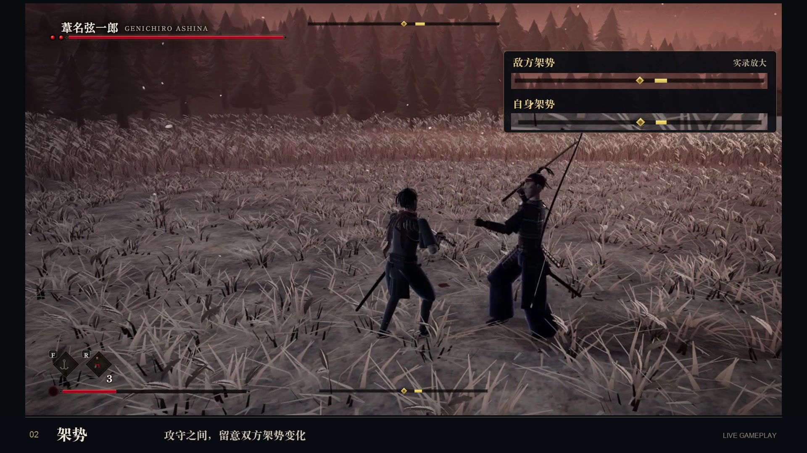

# 只狼 · Three.js

用 **Claude Code** 制作的浏览器动作游戏，向《Sekiro: Shadows Die Twice》致敬。以架势、弹反与忍杀为核心，使用 **Three.js + Vite + Web Audio**。

场景、角色模型、动画、特效、音乐与音效由代码生成；没有导入模型、贴图或音频文件。界面使用可选的 Google Fonts，无法连接时回退到本地字体。



*截图来自实际游戏录制，右上角是宣传片对原始架势条的同步放大，游戏本身保留顶部及底部 HUD。*

## 本地运行

需要 **Node.js 24+**、npm，以及支持 WebGL 2 的桌面浏览器。建议使用键盘与鼠标。

```bash
git clone https://github.com/AgainstEntropy/sekiro-threejs.git
cd sekiro-threejs
npm ci
npm run dev
```

打开终端显示的本地地址（默认 `http://localhost:5173`），点击开始。浏览器会捕获鼠标，按 Esc 暂停并释放鼠标。

```bash
npm run check   # 检查源码、沙盒和脚本的 JavaScript 语法
npm run build   # 构建到 dist/
npm run preview # 本地预览构建结果
```

## 已实现的玩法

- **架势与弹反**：恰好在命中前防御，可将架势压力施加给对方；架势积满后出现忍杀机会。生命较低时，架势恢复更慢。
- **危险攻击**：突刺可识破或弹反；下段需要跳跃；抓取需要避让。
- **忍杀**：架势崩溃、生命耗尽，以及满足条件的背后／空中偷袭。
- **回生与鬼佛**：倒下后可回生，彻底死亡后返回鬼佛；休息补充回复资源并重置敌人。
- **移动与探索**：锁定、闪避、冲刺、跳跃、钩绳与屋顶路线。
- **弦一郎 Boss 战**：两次忍杀、阶段切换、弓箭、连击与雷电奉还。

这是可玩的致敬原型，关卡从破庙，经庭院与城门，延伸至月下苇原；不等同于原作完整内容。当前以桌面操作为主，未提供触屏控制。

## 操作

| 动作 | 键盘／鼠标 | 手柄映射 |
|---|---|---|
| 移动 | WASD | 左摇杆 |
| 镜头 | 鼠标 | 右摇杆 |
| 攻击／忍杀 | 左键或 J；长按蓄力 | RB |
| 防御／弹反 | 右键或 K；长按防御，命中前按下弹反 | LB |
| 闪避／冲刺 | Shift；短按闪避、长按冲刺 | B |
| 跳跃 | Space | A |
| 锁定 | Q 或鼠标中键 | R3 |
| 钩绳 | F，出现绿色标记时 | LT |
| 药葫芦 | R | X |
| 交互／休息／回生 | E | Y |
| 暂停 | Esc | Start |
| 静音 | M | — |

暂停菜单可调整灵敏度、反转 Y 轴与音量。手柄映射已实现，不同设备的兼容性仍需实际验证。

## 代码结构

```text
src/
  core/       游戏循环、状态切换、输入与基础配置
  combat/     命中判定、架势、弹反、忍杀与投射物
  entities/   玩家状态机、敌人 AI、Boss
  world/      程序化场景、碰撞、植被与光照
  rig/        角色建模、骨骼与程序化动画
  camera/     镜头、锁定与遮挡处理
  fx/         火花、轨迹、粒子与后处理
  audio/      Web Audio 合成、环境音与音乐
  ui/         HUD、架势条、菜单与提示
sandbox/      独立模块调试页面
scripts/      可移植的检查脚本
```

阅读 [架构说明](docs/ARCHITECTURE.md) 和 [开发指南](docs/DEVELOPMENT.md)。发布版保留游戏和沙盒；早期依赖个人机器路径的一次性实验脚本、录制辅助组件与大体积视频未放入代码仓库。

## 关于本项目

这是非官方 fan-made tribute，与原作开发商及发行商无关联。原作名称与相关角色用于说明致敬对象。仓库目前未指定代码许可证。
